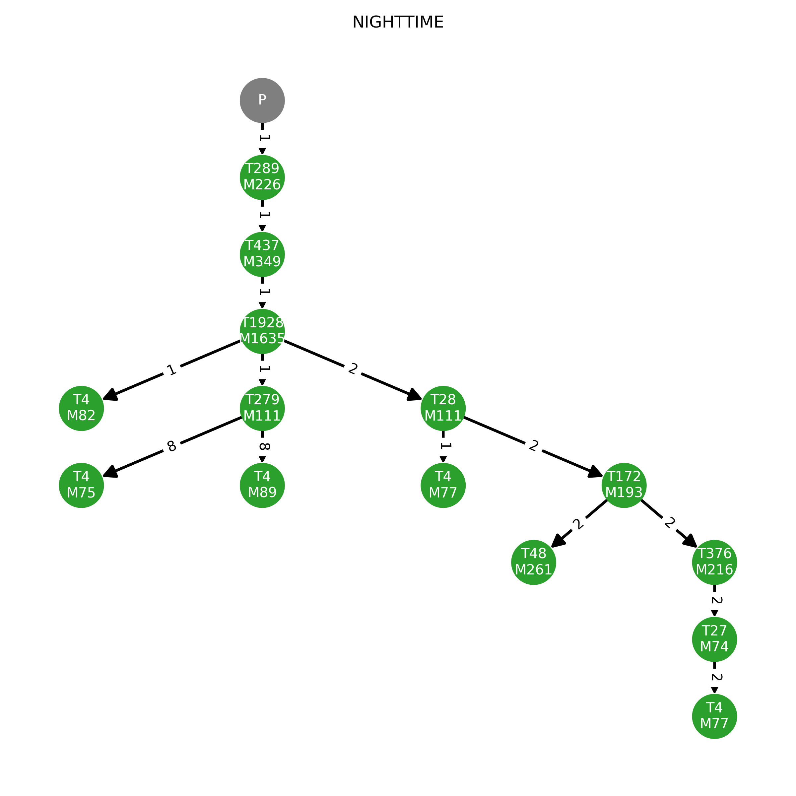
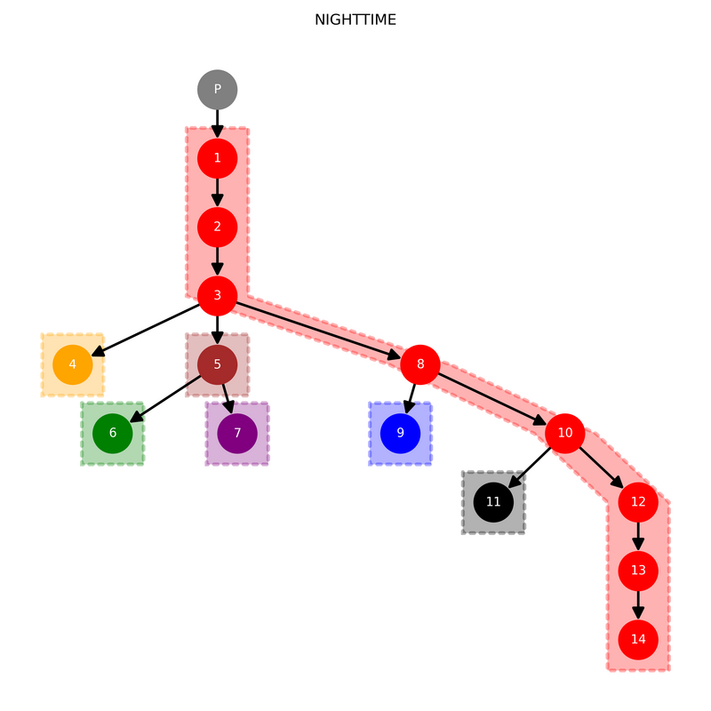

# Serverless Application Composition (SAC)


## Overview

This repository collects the prototype implementations and belonging test files of our Serverless Application Composition algorithms.
These algorithms are fundamentally performing the partitioning of a cloud-native application's basic components (serverless functions),
where the resulted partition blocks designate the deployment artifacts (assembled functions) providing cost-minimal operation in the cloud.


## Applied Method

Our approaches consider the main application and its components in the form of invocation-dependency or [call graph](https://en.wikipedia.org/wiki/Call_graph), that is as a directed tree in which nodes denotes the software components (functions) and directed edges represent the
invocations.

The input graph is annotated with node weights denoting the serverless functions' reference execution times and memory requirements 
(and deployment sizes) and with edge weights representing the overall invocation frequencies between the caller and callee functions.

In addition, algorithms take several restrictions into account:
Firstly, algorithms assume a common and predefined platform flavor for all deployed artifacts, that restricts the amount of operative memory
and the available number of vCPU cores (and sum deployment sizes).
Secondly, algorithms can accept an upper latency limit on a user-defined critical path in the call graph.

The main objective is to find the cost-minimal partitioning of the input tree's nodes while the platform and user-based limitations are satisfied.
The output of the algorithms are disjoint sets of nodes representing the assembled artifacts.
The core concept of the provided algorithms is to reduce the state space by eliminating dominated states of sub-partitioning.
The problem definitions are mostly based on recursive formulations of the optimal partitioning with respect to a given sub-graph.
Then, leveraging the step-by-step processing of the input graph along with dynamic programming techniques, the targeted problem can be
solved in polynomial time.


## Installation

Our implementations aim to rely only a minimal number of dependencies external to Python's standard libraries.
The prototypes are tested with Python 3.10.

The following dependencies are utilized:

*  [Networkx](https://networkx.org/) - for the input graph representation and some basic graph operations 
*  [Numpy](https://numpy.org/) - for vectorized matrix operations

Other packages are also leveraged for the tests.
All dependencies can be installed simply with the following command:

```sh
python3.10 -m pip install -r requirements.txt
```


## Usage and Tests

Two different group of algorithms are provided:
*  _Chain partitioning_ performs partitioning of simple chains in an effective way without relying on any graph operation.
*  _Tree partitioning_ partitions trees either by using chain partitioning as a subroutine or by a more-direct bottom-up traversal.

The algorithm implementations are available under [/alg/](alg).
The related tests files are stored in [/tests/chain/](tests/chain/) for the chain partitioning and in [/tests/tree/](tests/tree/)
for the trees.

Validations tests are provided for both methods in [/tests/](tests/) where each algorithm is tested on random-generated inputs and 
ultimately compared to each other and to the result(s) of straightforward greedy algorithms that apply brute-force techniques to 
search through the state space.
Moreover, the running time statistics of the different implementations are also provided.

The different tests can be performed by uncommenting the relevant lines in the _main_ section of the validations scripts.

```sh
python3.10 validation_chain.py
python3.10 validation_tree.py
```


## Example Use Case


Under [/use_case/](use_case/) the test input files and validations script can be found for our example use case applications.
The imagined application represents a backend application for a parking lot monitoring and management service for which the application
characteristics, such as the invocation frequencies and function execution times, are alternated between the typical daytime and 
nighttime operation due to the different traffic patterns.
The used inputs for the tests are also visualized, see the following two input trees for the nighttime traffic pattern:



The optimal partitioning of the applications for the nighttime traffic pattern is the following:



The partitioning results and the sub-optimal partitionign properties for the altered traffic patterns can be also generated by the scripts.


## Simulation of our Multiprocessing-based Platform Computation Model

Test scripts are provided in [comp_sim/](comp_sim/) as a proof-of-concept implementation of our proposed Platform Computation Model.

In order to execute the simple emulation, run the following command:

```sh
./comp_sim/parallel.py
```

It is worth noting that the computation model should be extensively tested on hardware providing a higher number of CPU cores. 


## License

Our prototype algorithms are licensed under [Apache 2.0](LICENSE).
