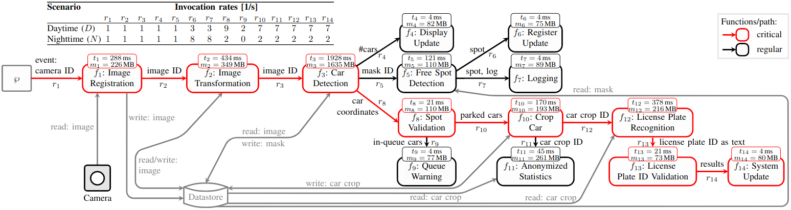

# Serverless Application Composition (SAC)

[Overview](#overview) | [Installation](#installation) | [Input/Output](#inputoutput) | [Usage and Tests](#usage-and-tests) | 
[Example Use Case](#example-use-case) | [Multiprocessing-based Platform Computation Model](#multiprocessing-based-platform-computation-model) | [License](#license)

## Note

All of these algorithms are also implemented and integrated into our unified library [SLAMBUC](https://github.com/hsnlab/SLAMBUC).

## Overview

This repository collects the prototype implementations and belonging test files of our Serverless Application Composition algorithms.
These algorithms are fundamentally performing the partitioning of a cloud-native application's basic components (serverless functions),
where the resulted partition blocks designate the deployment artifacts (assembled functions) providing cost-minimal operation in the cloud.
By these means, a serverless application can be assembled from its basic components on demand to achieve a cost-efficient operation with
respect to the actual application characteristics.

Our paper has been accepted as a full paper for [2023 IEEE/IFIP Network Operations and Management Symposium (NOMS'23)](https://noms2023.ieee-noms.org/).

If you use these algorithms for a publication or project, please cite the accompanying paper:

J. Czentye, I. Pelle and B. Sonkoly, "Cost-optimal Operation of Latency Constrained Serverless Applications: From Theory to Practice," NOMS 2023 IEEE/IFIP Network Operations and Management Symposium, Miami, FL, USA, 2023, pp. 1-10.

## Installation

Our implementations aim to rely only a minimal number of dependencies external to Python's standard libraries. 
The algorithms and other scripts are tested with Python 3.10.

The following main dependencies are used in the implementations:

*  [Networkx](https://networkx.org/) - for the input graph representation and some basic graph operations 
*  [Numpy](https://numpy.org/) - for vectorized matrix operations

Other packages are also leveraged for the tests. 
All the dependencies can be installed simply with the following command:

```sh
python3.10 -m pip install -r requirements.txt
```


## Input/Output

Our approaches consider the main application and its components in the form of invocation-dependency or [call graph](https://en.wikipedia.org/wiki/Call_graph), that is as a directed tree in which nodes denote the software components (serverless functions) and directed edges 
represent the direct invocations between the different functions.

The input graph is annotated with node weights denoting the serverless functions' reference execution times and memory requirements 
(and additionally the deployment sizes) and with edge weights representing the overall invocation frequencies between the caller and
callee functions.

In addition, algorithms take several restrictions into account during the partition calculations:
Firstly, algorithms assume a common and predefined platform flavor for all deployed artifacts. This restricts the computation and 
storage resources, that is the amount of accessible operative memory (and sum deployment sizes) and also the available number of vCPU
cores as the allocated CPU power is proportional to the amount of configured memory. For example, limits in Amazon's cloud (AWS) can be found
[here](https://docs.aws.amazon.com/lambda/latest/dg/gettingstarted-limits.html).
Secondly, algorithms can accept an upper latency limit on a user-defined critical path in the call graph. This can enforce the application
to process and store the important outcome of a received input data in the given time frame.
Examples for the service's graph representation in GML format can be found in [use_case/](use_case/) and in [tests/tree/](tests/tree/).

The main objective is to find the cost-minimal partitioning of the input tree's nodes while the platform and user-based limitations are satisfied.
The output of the algorithms are disjoint sets of node IDs representing the assembled artifacts, e.g.:

```
[[1, 2, 5], [3, 7], [4], [6, 9], [8], [10]]
```

The core concept of the provided algorithms is to reduce the state space by eliminating dominated states of sub-partitioning.
The problem definitions are mostly based on recursive formulations of the optimal partitioning with respect to a given sub-graph.
Then, leveraging the step-by-step processing of the input graph along with dynamic programming techniques, the targeted problem can be
solved in polynomial time.


## Usage and Tests

Two different group of algorithms are provided:
*  _Chain partitioning_ performs partitioning of simple chains in an effective way without relying on any graph operation.
*  _Tree partitioning_ partitions trees either by using chain partitioning as a subroutine or by a more-direct bottom-up traversal.

The algorithm implementations are available under [alg/](alg).
The related tests files are stored in [tests/chain/](tests/chain/) for the chain partitioning and in [tests/tree/](tests/tree/)
for the trees.

Validations tests are provided for both methods in [tests/](tests/) where each algorithm is tested on random-generated inputs and 
ultimately compared to each other and to the result(s) of straightforward greedy algorithms that apply brute-force techniques to 
search through the state space.
Moreover, the running time statistics of the different implementations are also collected.

The different tests can be performed by uncommenting the relevant lines in the _main_ section of the validations scripts.

```sh
python3.10 validation_chain.py
python3.10 validation_tree.py
```


## Example Use Case

An exemple use case application is also prepared in this repo in [use_case/](use_case/) with the following schematic architecture:



Under [use_case/](use_case/) the test input files, the generator scrpts and the related validations can be found.
The generated service descriptions is stored in [GML format](https://networkx.org/documentation/stable/reference/readwrite/gml.html).
The imagined application represents a backend service for a parking lot monitoring and management framework where the application
characteristics, such as the invocation frequencies and function execution times, are alternated between the typical daytime and 
nighttime operations due to different traffic patterns and the number of detected cars in the parking lot.
The used inputs for the tests are also visualized and stored in [use_case/ext/](use_case/ext/). 

For example, the following input tree describes the application's structure for the nighttime traffic pattern:


The calculated optimal partitioning for the nighttime traffic pattern is then the following:


The partitioning results and the sub-optimal partitionign setups for the altered traffic patterns can be also generated by the scripts.


## Multiprocessing-based Platform Computation Model

In addition, test scripts are provided in [comp_sim/](comp_sim/) as a proof-of-concept implementation of our proposed Platform Computation Model.
In order to execute the simple emulation, run the following command:

```sh
./comp_sim/parallel.py
```

It is worth noting that the computation model should adn can be extensively tested on hardware providing a higher number of CPU cores.


## License

Our prototype algorithms are licensed under [Apache 2.0](LICENSE).
